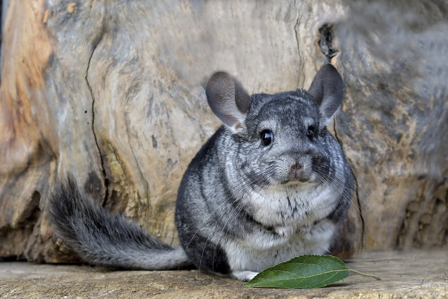
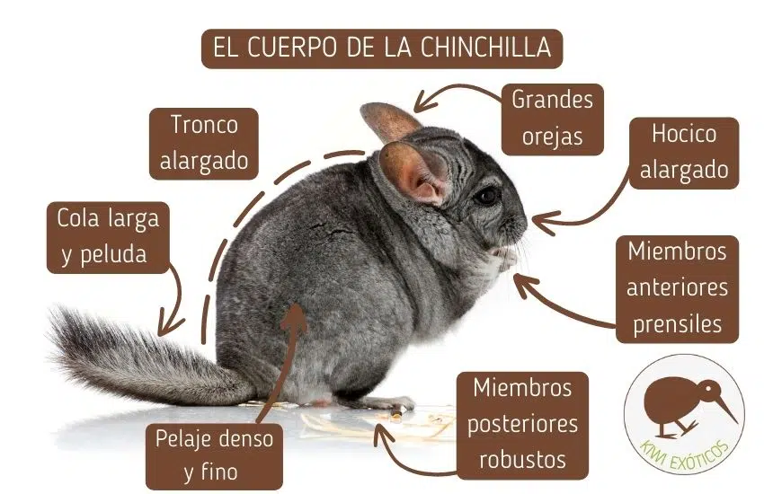
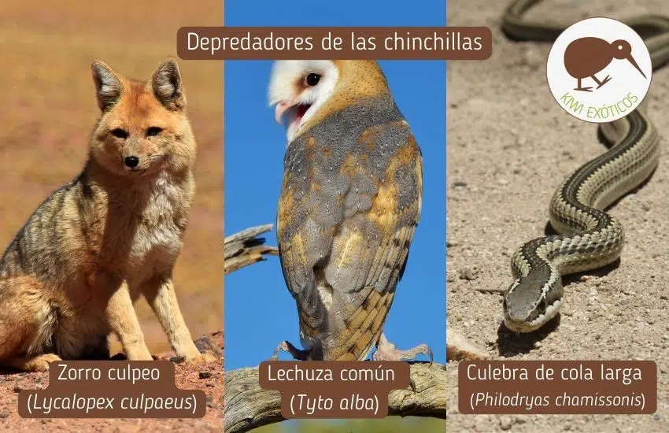

**Origen y Hábitat**

Las chinchillas son roedores originarios de Sudamérica, específicamente de las regiones montañosas de Bolivia, Chile, Argentina y Perú. Existen dos especies principales: Chinchilla lanigera, de cuerpo más esbelto

**Características de las Chinchillas**

Pelaje único:
Su pelaje es el más denso del mundo animal, con hasta 80 pelos creciendo de cada folículo, en comparación con un solo pelo en los humanos. Esto las protege del frío extremo de las montañas, pero también las hace vulnerables al calor y a la humedad.

Tamaño y apariencia:
Una chinchilla adulta mide entre 20 y 30 cm, sin contar su esponjosa cola, que añade otros 10-15 cm. Su peso varía entre 400 y 800 gramos. Tienen orejas grandes, que ayudan a regular su temperatura corporal, y ojos oscuros rodeados de gruesos párpados para protegerlos del polvo y el viento.

Habilidades motoras:
Son expertas escaladoras y saltadoras. Sus patas traseras musculosas les permiten saltar hasta 2 metros de altura, una habilidad vital para escapar de depredadores en su hábitat natural.

**Ciclo de Vida**

Reproducción:
Las chinchillas son animales vivíparos. La hembra tiene un periodo de gestación largo para un roedor, de 111 días, lo que resulta en crías bien desarrolladas al nacer: con los ojos abiertos y cubiertas de pelo. Típicamente, las camadas tienen entre 1 y 3 crías.

Esperanza de vida:
En la naturaleza, las chinchillas viven alrededor de 8 a 10 años, aunque en cautiverio pueden llegar a los 20 años, siempre que se les cuide adecuadamente.

**Dieta y Comportamiento**

Dieta:
Su alimentación incluye hierbas secas, semillas, corteza de árboles y pequeños cactus. En cautiverio, requieren un alimento balanceado y heno para mantener su sistema digestivo en óptimas condiciones.

Higiene:
A diferencia de otros mamíferos, no usan agua para limpiarse. En su lugar, toman baños de polvo con arcilla volcánica, lo que ayuda a mantener su piel seca y su pelaje libre de aceites y suciedad.

Comportamiento social:
Son animales nocturnos y crepusculares, lo que significa que están más activas durante el amanecer y el anochecer. Viven en colonias o grupos familiares llamados manadas, lo que les ayuda a protegerse de los depredadores.

**Conservación y Desafíos**

Amenazas principales:

La caza por su pelaje.
La destrucción de su hábitat debido a la minería y la agricultura.
La captura para el comercio de mascotas.
Esfuerzos de conservación:
Programas internacionales trabajan para preservar estas especies mediante la protección de su hábitat y la prohibición de la caza. Además, las chinchillas domésticas, aunque comunes, no deben ser liberadas en la naturaleza, ya que no son idénticas a las poblaciones salvajes y podrían alterar los ecosistemas locales.

