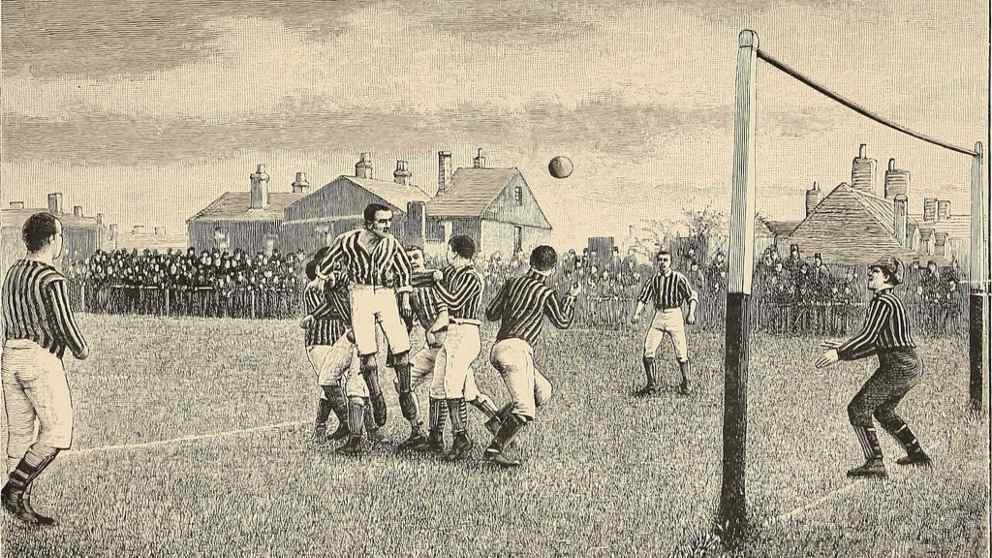
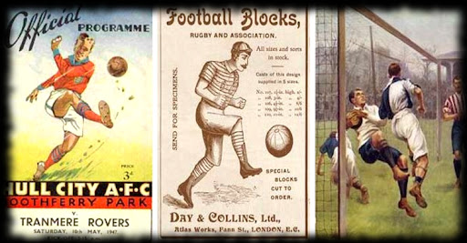
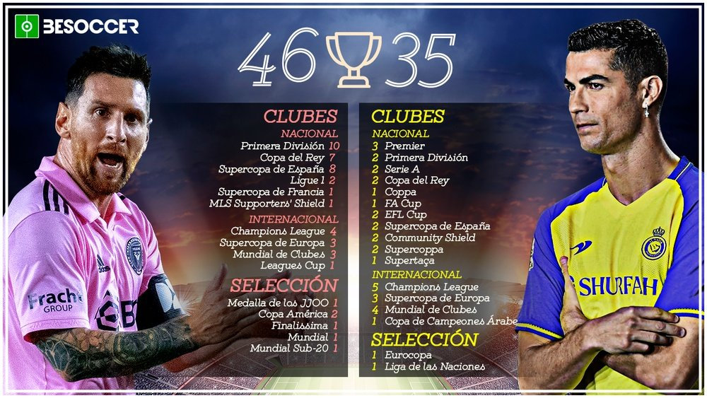

1. Los orígenes antiguos
Juegos similares al fútbol: Varias civilizaciones practicaron juegos que involucraban una pelota. Por ejemplo:
China (Siglo III a.C.): Se practicaba el cuju, un juego en el que se debía patear una pelota hacia una red.
Civilizaciones mesoamericanas: Jugaban al tlachtli, que combinaba deporte con rituales religiosos.
Roma y Grecia antiguas: Se jugaban juegos como el harpastum, donde los jugadores intentaban llevar una pelota a una meta.
Inglaterra medieval: Se jugaban versiones primitivas del fútbol en pueblos, donde no había reglas claras, y podían participar decenas o cientos de personas.

2. La evolución hacia el fútbol moderno
Siglo XIX en Inglaterra:
Durante este período, las escuelas inglesas desarrollaron versiones más organizadas del juego, cada una con sus propias reglas.
En 1848 se creó el Código de Cambridge, un conjunto de reglas que buscaba unificar las variantes del fútbol.
En 1863 se fundó la Football Association (FA) en Inglaterra, marcando el nacimiento del fútbol moderno. Este organismo definió reglas claras y prohibió el uso de las manos (diferenciándose del rugby).
La primera competición oficial fue la FA Cup en 1871.

3. Expansión global
Finales del siglo XIX: El fútbol se extendió rápidamente a Europa y América Latina gracias a marineros, comerciantes y misioneros británicos.
Primeros clubes internacionales: Se fundaron clubes como el Genoa C.F.C. en Italia (1893) y el Real Madrid en España (1902).
Primer partido internacional: Se jugó en 1872 entre Escocia e Inglaterra.

4. Fútbol como deporte profesional
1904: Se creó la Fédération Internationale de Football Association (FIFA) en París, con el objetivo de organizar el deporte a nivel internacional.
Copa del Mundo: En 1930, la FIFA organizó la primera Copa Mundial en Uruguay, con 13 equipos participantes.
Ligas profesionales: Desde principios del siglo XX, muchos países desarrollaron ligas profesionales, como la Premier League (Inglaterra) y la Serie A (Italia).

5. Fútbol en el siglo XX
Innovaciones técnicas y tácticas: A lo largo del siglo XX, el fútbol experimentó cambios tácticos y avances en la preparación física.
Popularidad masiva: Con la llegada de la televisión en las décadas de 1950 y 1960, el fútbol se convirtió en un fenómeno global.
Figuras legendarias: Jugadores como Pelé, Diego Maradona, Johan Cruyff y, más recientemente, Lionel Messi y Cristiano Ronaldo, marcaron eras del fútbol.

6. Fútbol en el siglo XXI
Globalización: Hoy en día, el fútbol es el deporte más popular del mundo, con miles de millones de seguidores.
Tecnología: Se han introducido innovaciones como el VAR (asistencia arbitral por video) para mejorar la justicia en el juego.
Eventos masivos: La Copa del Mundo y la Liga de Campeones de la UEFA son los eventos más vistos en el mundo.

