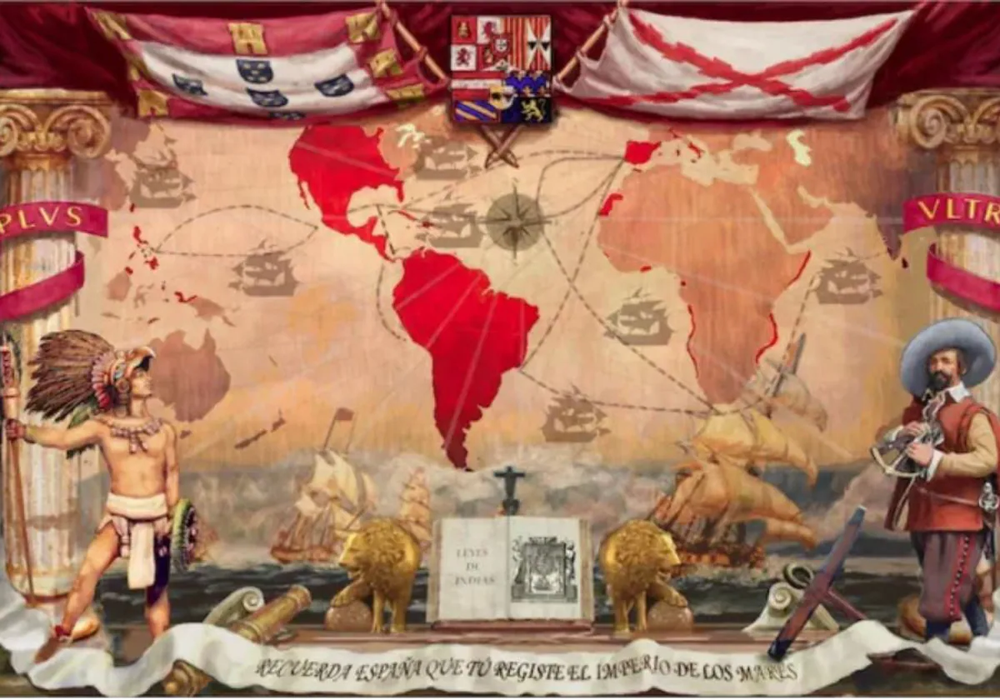

La **Época Dorada de España**, conocida como el **Siglo de Oro**, abarca un período histórico y cultural que se extiende aproximadamente desde finales del siglo XV hasta el siglo XVII. Durante este tiempo, España vivió una época de esplendor en el ámbito político, económico, militar, artístico y literario, aunque también estuvo marcada por grandes contradicciones, como conflictos internos y crisis económicas. A continuación, te explico los principales aspectos:

## **Contexto histórico:**
1. **Unificación de los reinos:**  
   La consolidación de España como una nación unificada comenzó con el matrimonio de los Reyes Católicos, Isabel de Castilla y Fernando de Aragón, quienes completaron la Reconquista en 1492 con la toma de Granada. También ese año, Cristóbal Colón descubrió América, marcando el inicio del Imperio español.

2. **Expansión del Imperio:**  
   Durante los reinados de Carlos I y Felipe II, España se convirtió en una de las principales potencias mundiales. Controlaba vastos territorios en América, Europa, Asia y África, lo que le otorgaba una gran influencia global.  
   - **Carlos I (1516-1556):** Heredó un vasto imperio que incluía España, las posesiones italianas, los Países Bajos y territorios en América. Fue también emperador del Sacro Imperio Romano Germánico.  
   - **Felipe II (1556-1598):** Consolidó el imperio y trasladó la capital a Madrid. Defendió el catolicismo en guerras religiosas, como contra Inglaterra (Armada Invencible) y en la Batalla de Lepanto contra los turcos.

3. **Decadencia progresiva:**  
   Hacia finales del siglo XVII, el Siglo de Oro declinó debido a la pérdida de influencia internacional, crisis económicas derivadas de una mala gestión de recursos (incluido el oro y la plata de América), guerras interminables y tensiones internas.

---

### **Aspectos culturales y artísticos:**
La denominación de "Siglo de Oro" se debe sobre todo al auge de las artes y las letras. España vivió una explosión creativa en campos como la literatura, la pintura y el teatro.

#### **Literatura:**
1. **Prosa y novela:**  
   - **Miguel de Cervantes:** Autor de *El ingenioso hidalgo don Quijote de la Mancha* (1605 y 1615), considerada la primera novela moderna.  
   - **Picaresca:** Obras como *El Lazarillo de Tormes* (1554) reflejan las dificultades sociales de la época con un tono crítico y humorístico.

2. **Poesía:**  
   - **Luis de Góngora:** Exponente del culteranismo, caracterizado por su estilo complejo y ornamentado.  
   - **Francisco de Quevedo:** Representante del conceptismo, más directo y satírico.

3. **Teatro:**  
   - **Lope de Vega:** Revolucionó el teatro con su fórmula de la "comedia nueva", accesible y popular.  
   - **Calderón de la Barca:** Autor de obras filosóficas y religiosas como *La vida es sueño*.  

#### **Arte:**
1. **Pintura:**  
   - **El Greco:** Su estilo manierista destacó por sus composiciones dramáticas y espiritualidad.  
   - **Diego Velázquez:** Pintor de la corte de Felipe IV, famoso por obras como *Las Meninas* y su maestría en la representación de la realidad.  
   - **Murillo y Zurbarán:** Representantes del arte religioso y costumbrista.

2. **Arquitectura:**  
   - **Estilo Herreriano:** Sobrio y monumental, como el Monasterio de El Escorial.  
   - **Barroco español:** Exuberancia decorativa, vista en iglesias y palacios.

#### **Música:**  
Compositores como Tomás Luis de Victoria (música sacra) y los polifonistas hispánicos llevaron la música religiosa española a su máximo esplendor.

---

### **Contradicciones del Siglo de Oro:**
1. **Éxito cultural vs. crisis económica:**  
   Aunque España destacaba en las artes, su economía sufrió por el gasto excesivo en guerras, la inflación causada por la llegada de metales preciosos de América y la falta de una industria sólida.

2. **Esplendor imperial vs. tensiones sociales:**  
   El Imperio español alcanzó su apogeo territorial, pero la desigualdad social, la persecución religiosa (Inquisición) y la expulsión de los moriscos (1609) causaron tensiones internas.

3. **Declive político:**  
   Las derrotas militares, como la pérdida de la Armada Invencible (1588), y las rebeliones en territorios como los Países Bajos marcaron el principio del fin del dominio español.

---

### **Legado:**
El Siglo de Oro dejó una huella indeleble en la historia mundial. La literatura, el arte y la música de esta época siguen siendo estudiados y admirados como cumbres de la creatividad humana. Sin embargo, también sirve como ejemplo de cómo el auge y la decadencia pueden coexistir en una nación.

 